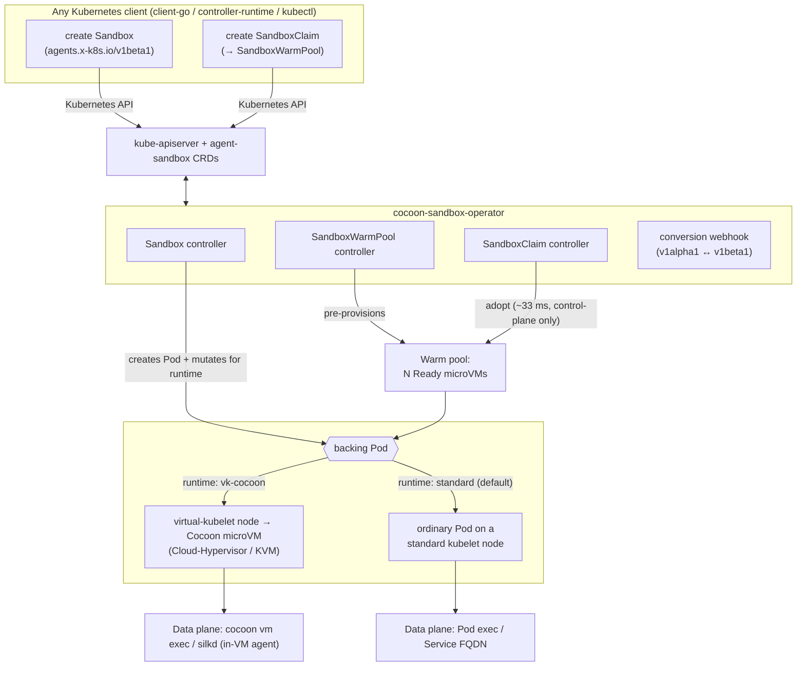

# cocoon-sandbox-operator

A Kubernetes operator for **fast, warm-poolable agent sandboxes backed by real
microVMs**. It implements the [`kubernetes-sigs/agent-sandbox`](https://github.com/kubernetes-sigs/agent-sandbox)
API in full and is driven **entirely through the standard Kubernetes API** — no
proprietary SDK. A pre-warmed sandbox is acquired in **~33 ms at p50**, below
e2b's published ~150 ms sandbox start, and each sandbox is a genuine
Cloud-Hypervisor/KVM microVM, not a shared-kernel container (see
[PERFORMANCE.md](PERFORMANCE.md)).

You create an `agents.x-k8s.io` `Sandbox` with any Kubernetes client; the
operator schedules it, and with the `vk-cocoon` runtime the backing Pod is
materialized as a [Cocoon](https://github.com/cocoonstack/cocoon) microVM on a
virtual-kubelet node. A portable **standard-kubelet** backend (ordinary Pods, any
conformant cluster) is also available for environments without the microVM
substrate.

## Why

| | |
|---|---|
| ✅ **Standards-compliant** | Implements the complete `agents.x-k8s.io` `Sandbox` (v1alpha1 + v1beta1) API and the `extensions.agents.x-k8s.io` `SandboxTemplate` / `SandboxWarmPool` / `SandboxClaim` API from [kubernetes-sigs/agent-sandbox](https://github.com/kubernetes-sigs/agent-sandbox), including conversion webhooks, lifecycle, status/conditions, PVCs, Services, and NetworkPolicy. |
| ✅ **Pure Kubernetes SDK** | Create and manage sandboxes with any Kubernetes client — [`client-go`](https://github.com/kubernetes/client-go), [`controller-runtime`](https://github.com/kubernetes-sigs/controller-runtime), `kubectl`, or the client library of any language. The control plane is 100% Kubernetes CRDs. |
| ✅ **Real microVM isolation** | With `vk-cocoon`, each sandbox is a hardware-isolated Cloud-Hypervisor/KVM guest via [vk-cocoon](https://github.com/cocoonstack/vk-cocoon) + [cocoon](https://github.com/cocoonstack/cocoon) — not a shared-kernel container. Warm claims stay Kubernetes-native. |
| ✅ **Faster than hosted microVM services** | Pre-warmed claim p50 **~33 ms** (real microVM) vs e2b's published ~150 ms. Validated to a warm pool of **thousands of concurrent microVMs**. Full numbers and methodology in [PERFORMANCE.md](PERFORMANCE.md). |

## Architecture



- **Cold path:** a `Sandbox` (or `SandboxClaim` with no warm pool) creates a Pod
  on demand; with `vk-cocoon` the Pod boots a microVM.
- **Warm path:** a `SandboxWarmPool` keeps N microVMs Ready; a `SandboxClaim`
  *adopts* one instantly (control-plane only — the microVM is already booted),
  then the warm pool replenishes in the background. This is the ~33 ms path.
- **Deeper tier:** the [`cocoonstack/sandbox`](https://github.com/cocoonstack/sandbox)
  runtime this builds on has a node-local `sandboxd` warm pool whose claims are
  **0.2–0.7 ms** (VM ownership transfer) via its own Go/Python SDK — use it when
  you want sub-millisecond claims outside the Kubernetes control plane.

## API coverage

| API | Implemented semantics |
|---|---|
| `agents.x-k8s.io/v1beta1` **Sandbox** | Pod, PVC, optional headless Service, status/conditions, suspend/resume, expiry & shutdown policy, resource adoption, metadata propagation, dual-stack status, v1alpha1 conversion |
| `extensions.agents.x-k8s.io/v1beta1` **SandboxTemplate** | reusable blueprints, managed/unmanaged NetworkPolicy, secure defaults, env & PVC injection policy, conversion |
| `extensions.agents.x-k8s.io/v1beta1` **SandboxWarmPool** | desired/ready capacity, `scale` subresource, template-drift & update strategies, warm replenishment, conversion |
| `extensions.agents.x-k8s.io/v1beta1` **SandboxClaim** | atomic warm adoption, cold fallback, lifecycle & finished TTL, foreground deletion, metadata/env/PVC injection, conversion |

v1beta1 is the storage version; v1alpha1 remains served via conversion webhooks.
Upstream provenance and the pinned revision are in [UPSTREAM.md](UPSTREAM.md).

## Use it with the Kubernetes SDK

Typed (controller-runtime), or `unstructured` / dynamic client if you don't want
to vendor the types:

```go
import (
    sandboxv1beta1 "github.com/cocoonstack/cocoon-sandbox-operator/api/v1beta1"
    "sigs.k8s.io/controller-runtime/pkg/client"
)

sb := &sandboxv1beta1.Sandbox{
    ObjectMeta: metav1.ObjectMeta{Name: "demo", Namespace: "default"},
    Spec: sandboxv1beta1.SandboxSpec{
        SandboxBlueprint: sandboxv1beta1.SandboxBlueprint{
            PodTemplate: sandboxv1beta1.PodTemplate{
                // Opt into a real microVM; omit for the portable standard-kubelet backend.
                ObjectMeta: sandboxv1beta1.PodMetadata{
                    Annotations: map[string]string{"sandbox.cocoonstack.io/runtime": "vk-cocoon"},
                },
                Spec: corev1.PodSpec{
                    Containers: []corev1.Container{{Name: "agent", Image: "ghcr.io/cocoonstack/cocoon/ubuntu:24.04"}},
                },
            },
        },
    },
}
_ = c.Create(ctx, sb) // standard client-go / controller-runtime client
```

Or plain YAML:

```yaml
apiVersion: agents.x-k8s.io/v1beta1
kind: Sandbox
metadata: { name: demo, namespace: default }
spec:
  podTemplate:
    metadata:
      annotations: { sandbox.cocoonstack.io/runtime: vk-cocoon }   # real microVM
    spec:
      containers:
        - { name: agent, image: ghcr.io/cocoonstack/cocoon/ubuntu:24.04 }
```

For low-latency acquisition, define a `SandboxTemplate` + `SandboxWarmPool` and
create `SandboxClaim`s — see [examples/](examples/).

## Install

Helm:

```bash
helm upgrade --install cocoon-sandbox-operator ./helm \
  --namespace cocoon-sandbox-system --create-namespace \
  --set image.tag=<version>
```

Kustomize (replace the `ko://` image reference):

```bash
kustomize build k8s | sed 's#ko://.*/cocoon-sandbox-operator#ghcr.io/cocoonstack/cocoon-sandbox-operator:<version>#' | kubectl apply -f -
```

The default (standard-kubelet) backend needs no special nodes. The `vk-cocoon`
backend requires [vk-cocoon](https://github.com/cocoonstack/vk-cocoon) virtual
nodes. See [docs/migration-from-mindos.md](docs/migration-from-mindos.md) for a
safe, no-double-write rollout alongside an existing installation.

## Runtime backends

Standard kubelet is the default. To place a sandbox on the `vk-cocoon` microVM
backend, set the Pod-template annotation
`sandbox.cocoonstack.io/runtime: vk-cocoon`; the adapter adds only the missing
scheduling fields (`node.kubernetes.io/instance-type=virtual-node`, the provider
toleration, and the `cocoonset.cocoonstack.io/*` boot annotations) and rejects
(never overwrites) conflicting explicit values. See
[docs/runtime-backends.md](docs/runtime-backends.md).

To pin sandboxes to specific nodes (for example, microVM hosts with fast local
NVMe/xfs storage), label those nodes and set a `nodeSelector` in the Pod template
or `SandboxTemplate`; the operator never mutates user-supplied scheduling.

## Performance

Summary (full methodology in [PERFORMANCE.md](PERFORMANCE.md), measured on a live
27-node microVM cluster via the Kubernetes SDK):

- **Warm-pool claim (real microVM):** p50 **~33 ms**, p95 ~39 ms, 100% warm hits
  — below e2b's published ~150 ms sandbox start, and holds constant as the pool
  grows from 10 to 2000+ sandboxes.
- **Scale:** a single `SandboxWarmPool` of thousands of concurrent microVMs; CR
  creation ~36/s, microVM boot ~27/s at scale; 0 operator restarts; production
  microVMs on the same cluster unaffected; clean scale-to-0 with 0 stuck
  finalizers.
- **Deeper tier:** the underlying `cocoonstack/sandbox` `sandboxd` warm pool
  claims in **0.2–0.7 ms** (its own published benchmarks) for use cases that can
  adopt its non-Kubernetes data plane.

## Development

Go 1.26+.

```bash
make all         # fmt-check vet test build
make test-race
make generate    # CRDs, RBAC, deepcopy (idempotent)
```

See [docs/](docs/) for API, configuration, and runtime details.

## License

Apache 2.0 — see [LICENSE](LICENSE). The `agents.x-k8s.io` APIs, controllers, and
conversion webhooks are imported from
[kubernetes-sigs/agent-sandbox](https://github.com/kubernetes-sigs/agent-sandbox)
(Apache 2.0); see [UPSTREAM.md](UPSTREAM.md).
