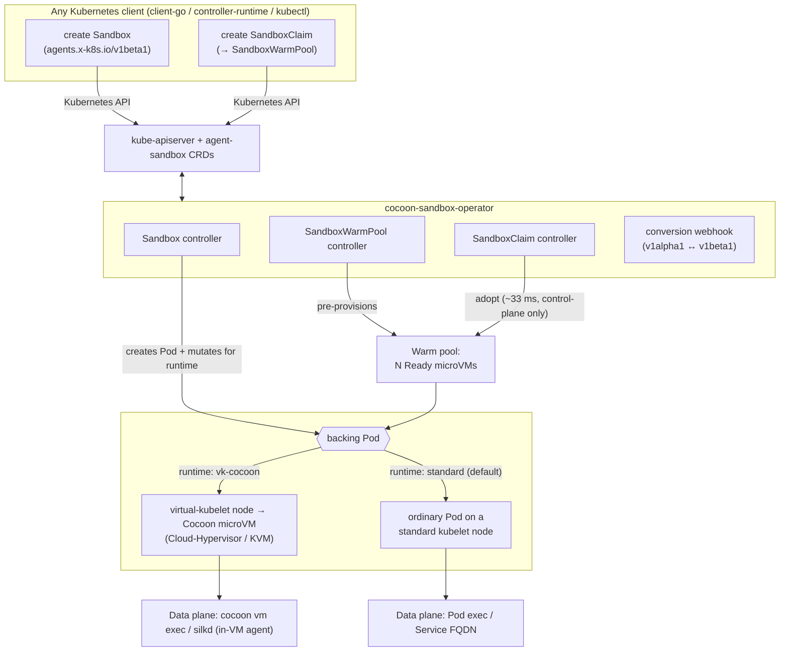
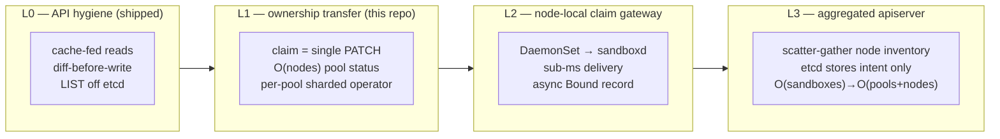

# cocoon-sandbox-operator

A Kubernetes operator for **fast, warm-poolable agent sandboxes backed by real
microVMs**. It implements the [`kubernetes-sigs/agent-sandbox`](https://github.com/kubernetes-sigs/agent-sandbox)
API in full and is driven **entirely through the standard Kubernetes API** — no
proprietary SDK. A pre-warmed sandbox is acquired in **~33 ms at p50**, below
e2b's published ~150 ms sandbox start, and each sandbox is a genuine
Cloud-Hypervisor/KVM microVM, not a shared-kernel container (see
[PERFORMANCE.md](PERFORMANCE.md)).

You create an `agents.x-k8s.io` `Sandbox` with any Kubernetes client; the
operator schedules it, and with the `vk-cocoon` runtime the backing Pod is
materialized as a [Cocoon](https://github.com/cocoonstack/cocoon) microVM on a
virtual-kubelet node. A portable **standard-kubelet** backend (ordinary Pods, any
conformant cluster) is also available for environments without the microVM
substrate.

## Why

| | |
|---|---|
| ✅ **Standards-compliant** | Implements the complete `agents.x-k8s.io` `Sandbox` (v1alpha1 + v1beta1) API and the `extensions.agents.x-k8s.io` `SandboxTemplate` / `SandboxWarmPool` / `SandboxClaim` API from [kubernetes-sigs/agent-sandbox](https://github.com/kubernetes-sigs/agent-sandbox), including conversion webhooks, lifecycle, status/conditions, PVCs, Services, and NetworkPolicy. |
| ✅ **Pure Kubernetes SDK** | Create and manage sandboxes with any Kubernetes client — [`client-go`](https://github.com/kubernetes/client-go), [`controller-runtime`](https://github.com/kubernetes-sigs/controller-runtime), `kubectl`, or the client library of any language. The control plane is 100% Kubernetes CRDs. |
| ✅ **Real microVM isolation** | With `vk-cocoon`, each sandbox is a hardware-isolated Cloud-Hypervisor/KVM guest via [vk-cocoon](https://github.com/cocoonstack/vk-cocoon) + [cocoon](https://github.com/cocoonstack/cocoon) — not a shared-kernel container. Warm claims stay Kubernetes-native. |
| ✅ **Faster than hosted microVM services** | Pre-warmed claim p50 **~33 ms** (real microVM) vs e2b's published ~150 ms. Validated to a warm pool of **thousands of concurrent microVMs**. Full numbers and methodology in [PERFORMANCE.md](PERFORMANCE.md). |

## Architecture



- **Cold path:** a `Sandbox` (or `SandboxClaim` with no warm pool) creates a Pod
  on demand; with `vk-cocoon` the Pod boots a microVM.
- **Warm path:** a `SandboxWarmPool` keeps N microVMs Ready; a `SandboxClaim`
  *adopts* one instantly (control-plane only — the microVM is already booted),
  then the warm pool replenishes in the background. This is the ~33 ms path.
- **Deeper tier:** the [`cocoonstack/sandbox`](https://github.com/cocoonstack/sandbox)
  runtime this builds on has a node-local `sandboxd` warm pool whose claims are
  **0.2–0.7 ms** (VM ownership transfer) via its own Go/Python SDK — use it when
  you want sub-millisecond claims outside the Kubernetes control plane.

## API coverage

| API | Implemented semantics |
|---|---|
| `agents.x-k8s.io/v1beta1` **Sandbox** | Pod, PVC, optional headless Service, status/conditions, suspend/resume, expiry & shutdown policy, resource adoption, metadata propagation, dual-stack status, v1alpha1 conversion |
| `extensions.agents.x-k8s.io/v1beta1` **SandboxTemplate** | reusable blueprints, managed/unmanaged NetworkPolicy, secure defaults, env & PVC injection policy, conversion |
| `extensions.agents.x-k8s.io/v1beta1` **SandboxWarmPool** | desired/ready capacity, `scale` subresource, template-drift & update strategies, warm replenishment, conversion |
| `extensions.agents.x-k8s.io/v1beta1` **SandboxClaim** | atomic warm adoption, cold fallback, lifecycle & finished TTL, foreground deletion, metadata/env/PVC injection, conversion |

v1beta1 is the storage version; v1alpha1 remains served via conversion webhooks.
Upstream provenance and the pinned revision are in [UPSTREAM.md](UPSTREAM.md).

## Use it with the Kubernetes SDK

Typed (controller-runtime), or `unstructured` / dynamic client if you don't want
to vendor the types:

```go
import (
    sandboxv1beta1 "github.com/cocoonstack/cocoon-sandbox-operator/api/v1beta1"
    "sigs.k8s.io/controller-runtime/pkg/client"
)

sb := &sandboxv1beta1.Sandbox{
    ObjectMeta: metav1.ObjectMeta{Name: "demo", Namespace: "default"},
    Spec: sandboxv1beta1.SandboxSpec{
        SandboxBlueprint: sandboxv1beta1.SandboxBlueprint{
            PodTemplate: sandboxv1beta1.PodTemplate{
                // Opt into a real microVM; omit for the portable standard-kubelet backend.
                ObjectMeta: sandboxv1beta1.PodMetadata{
                    Annotations: map[string]string{"sandbox.cocoonstack.io/runtime": "vk-cocoon"},
                },
                Spec: corev1.PodSpec{
                    Containers: []corev1.Container{{Name: "agent", Image: "ghcr.io/cocoonstack/cocoon/ubuntu:24.04"}},
                },
            },
        },
    },
}
_ = c.Create(ctx, sb) // standard client-go / controller-runtime client
```

Or plain YAML:

```yaml
apiVersion: agents.x-k8s.io/v1beta1
kind: Sandbox
metadata: { name: demo, namespace: default }
spec:
  podTemplate:
    metadata:
      annotations: { sandbox.cocoonstack.io/runtime: vk-cocoon }   # real microVM
    spec:
      containers:
        - { name: agent, image: ghcr.io/cocoonstack/cocoon/ubuntu:24.04 }
```

For low-latency acquisition, define a `SandboxTemplate` + `SandboxWarmPool` and
create `SandboxClaim`s — see [examples/](examples/).

## Install

Helm:

```bash
helm upgrade --install cocoon-sandbox-operator ./helm \
  --namespace cocoon-sandbox-system --create-namespace \
  --set image.tag=<version>
```

Kustomize (replace the `ko://` image reference):

```bash
kustomize build k8s | sed 's#ko://.*/cocoon-sandbox-operator#ghcr.io/cocoonstack/cocoon-sandbox-operator:<version>#' | kubectl apply -f -
```

The default (standard-kubelet) backend needs no special nodes. The `vk-cocoon`
backend requires [vk-cocoon](https://github.com/cocoonstack/vk-cocoon) virtual
nodes. See [docs/migration-from-mindos.md](docs/migration-from-mindos.md) for a
safe, no-double-write rollout alongside an existing installation.

## Runtime backends

Standard kubelet is the default. To place a sandbox on the `vk-cocoon` microVM
backend, set the Pod-template annotation
`sandbox.cocoonstack.io/runtime: vk-cocoon`; the adapter adds only the missing
scheduling fields (`node.kubernetes.io/instance-type=virtual-node`, the provider
toleration, and the `cocoonset.cocoonstack.io/*` boot annotations) and rejects
(never overwrites) conflicting explicit values. See
[docs/runtime-backends.md](docs/runtime-backends.md).

To pin sandboxes to specific nodes (for example, microVM hosts with fast local
NVMe/xfs storage), label those nodes and set a `nodeSelector` in the Pod template
or `SandboxTemplate`; the operator never mutates user-supplied scheduling.

## Performance

Summary (full methodology in [PERFORMANCE.md](PERFORMANCE.md), measured on a live
27-node microVM cluster via the Kubernetes SDK):

- **Warm-pool claim (real microVM):** p50 **~33 ms**, p95 ~39 ms, 100% warm hits
  — below e2b's published ~150 ms sandbox start, and holds constant as the pool
  grows from 10 to 2000+ sandboxes.
- **Scale:** a single `SandboxWarmPool` of thousands of concurrent microVMs; CR
  creation ~36/s, microVM boot ~27/s at scale; 0 operator restarts; production
  microVMs on the same cluster unaffected; clean scale-to-0 with 0 stuck
  finalizers.
- **Deeper tier:** the underlying `cocoonstack/sandbox` `sandboxd` warm pool
  claims in **0.2–0.7 ms** (its own published benchmarks) for use cases that can
  adopt its non-Kubernetes data plane.

## Scaling design: decentralized sandbox scheduling on Kubernetes semantics

Modal's ["1M concurrent sandboxes"](https://modal.com/blog/scaling-to-1-million-concurrent-sandboxes-in-seconds)
post argues Kubernetes cannot reach that scale: scheduling is `O(n×p)` and
serialized, every Pod causes multiple etcd writes, etcd is not shardable within a
keyspace, and kubelet heartbeats impose an `O(nodes)` write floor. Their answer is
to **leave Kubernetes entirely** — a fleet of stateless schedulers over in-memory
worker state published to a Redis stream, direct scheduler→worker RPC, and *no
datastore on the sandbox-creation critical path*.

Their diagnosis is correct. Their conclusion is not the only option. What Modal
actually removed is a **centralized transaction path**, not API semantics — and
Kubernetes already separates those two things in its own design: kubelet **static
Pods** (the node acts first, the apiserver records after), the **coordination.k8s.io
Lease** (a dedicated tiny object for heartbeats instead of full Node writes), and
the **metrics.k8s.io aggregation layer** (a virtual resource served by
scatter-gathering live node state, with *zero* etcd storage). Our thesis:

> **Keep Kubernetes as the record-of-intent and policy plane; push the
> transaction plane down to the node — behind CRDs, RBAC, and watch, so
> `kubectl get sandboxes` never stops working.**

We stage this as four layers. **L0 is shipped.** L1 is implemented in this repo.
L2/L3 have full designs, Go interface skeletons, and migration paths here;
their complete implementations are follow-up work.



### L0 — API hygiene (shipped)

The prerequisite, delivered in the `vk-cocoon` provider (2026-07-17): every
periodic read is served from a node-scoped informer cache, every write is
diffed first, and no control-loop `LIST` hits etcd (list at `ResourceVersion=0`,
or a field-selected node-local lister). This is the qualifier — without it any
scale test wedges the apiserver first. Measured on an idle virtual-kubelet node
afterward: **0.2 req/s, zero LIST** (lease renew + node-status patch only). The
root cause it fixed: Kubernetes APF prices `LIST` seats by the **total object
count** of the resource, so at 2500 pods even a tiny per-node list goes
max-width and saturates a dedicated priority level — client QPS caps cannot fix
a seat-seconds problem, only removing the lists can.

### L1 — claim is ownership transfer, not scheduling (implemented)

A warm claim is not a create. The Pod is already scheduled, bound, image-pulled,
and booted; a `SandboxClaim` only needs to **transfer ownership** of one
pre-warmed `Sandbox` — the exact semantics Kubernetes already ships for
`PersistentVolumeClaim → PersistentVolume` binding (`Phase: Bound`). Nothing on
the claim path needs the scheduler, kubelet bind, or image pull.

**Mechanisms**

1. **Claim fast-path — one select, one PATCH.** Pick one `warm ∧ unclaimed`
   Sandbox via a label index and adopt it with a single optimistic PATCH guarded
   by its `resourceVersion`. On conflict (two claims raced the same Sandbox), the
   loser simply tries the next candidate — no requeue, no exponential backoff, no
   adoption-cache-lag requeue. This collapses the claim to Modal's "two network
   hops and one cheap CPU op," expressed entirely in Kubernetes objects.
2. **Pool status is `O(nodes)`, not `O(sandboxes)`.** `readyReplicas` is
   maintained incrementally from informer add/update/delete events and
   metadata-only reads, so replenishment reconciliation never re-lists the full
   pool's Sandbox specs. A 2500-sandbox pool costs a counter update per event,
   not a 2500-object list per reconcile.
3. **Per-pool sharded operator.** Each `SandboxWarmPool` is an independent
   workqueue shard; operator replicas take a per-shard `coordination.k8s.io`
   Lease and scale horizontally. This is the Kubernetes-native spelling of
   Modal's "fleet of scheduling servers" — no shared scheduler serialization.

**Kubernetes-semantics mapping**

| Modal mechanism | L1 in pure Kubernetes |
|---|---|
| stateless scheduler fleet | per-pool sharded operator + Lease |
| worker accepts/rejects placement | optimistic PATCH with `resourceVersion` precondition |
| no datastore on create path | claim = ownership PATCH of a pre-warmed object (like PVC→PV `Bound`) |
| async result write | Sandbox status/conditions written after the fast-path returns |

**Failure modes**

| Scenario | Behavior | Breaks k8s semantics? |
|---|---|---|
| Two claims race one warm Sandbox | `resourceVersion` PATCH conflict; loser adopts the next candidate | No — standard optimistic concurrency |
| Warm pool exhausted | Claim stays `Pending` until replenish (unchanged) | No |
| Operator shard dies mid-claim | Lease expiry → another replica resumes; claim is idempotent | No |
| Stale informer picks an already-claimed Sandbox | PATCH precondition fails → next candidate | No |

**Acceptance:** claim p50 stays near-constant from a 100-pool to a 2000+-pool
(today it degrades 33 ms → 516 ms); the pod-exclusivity invariant (one Sandbox,
at most one claim) holds under concurrent claims.

### L2 — node-local claim gateway (designed; `ClaimGateway` skeleton)

L1 still round-trips the apiserver. L2 takes the claim off the central path
entirely for the runtimes that have a node-local warm pool (`sandboxd`), while
keeping the `SandboxClaim` object as the durable record.

**Mechanism.** A `ClaimGateway` DaemonSet on each virtual-kubelet node fronts
`sandboxd`. A claim request reaches the node gateway directly; `sandboxd` hands
over an already-running microVM in **0.2–0.7 ms** and returns connection info
immediately. The `SandboxClaim` is marked `Bound` **asynchronously** — the record
follows the action, exactly as kubelet static Pods record to the apiserver after
the container is already running.

**Authorization stays central (correctly).** The gateway runs a
`SubjectAccessReview` + `ResourceQuota` check before delivery. Policy is the part
of Kubernetes that *should* stay centralized; only the ownership-transfer
transaction moves to the node.

```go
// ClaimGateway is the node-local fast path for warm-pool claims.
// A claim is served by the node that already holds a warm microVM; the
// SandboxClaim object is reconciled to Bound asynchronously afterward.
type ClaimGateway interface {
    // Claim transfers ownership of a node-local warm sandbox to the caller,
    // returning connection info. It performs the SubjectAccessReview +
    // quota check inline; it does NOT block on writing the SandboxClaim.
    Claim(ctx context.Context, req ClaimRequest) (Assignment, error)
    // Release returns a sandbox to the node-local pool (or tears it down).
    Release(ctx context.Context, assignment Assignment) error
}
```

**Failure modes**

| Scenario | Behavior | Breaks k8s semantics? |
|---|---|---|
| Gateway crashes after delivery, before recording `Bound` | Orphan binding → audit-only orphan GC + adopt reconciles the record (the VM is never destroyed on pod-level state — see the delete-authorization contract) | No — eventual consistency |
| Node has no warm VM | Falls back to the L1 Kubernetes path (create a new Sandbox) | No |
| Quota exceeded | Gateway rejects inline before delivery | No |

**Acceptance:** claim p50 sub-millisecond on the sandboxd tier; orphan-binding
rate converges to 0 via GC; `kubectl get sandboxclaims` still shows every claim.

### L3 — aggregated apiserver: etcd stores intent, not sandboxes (designed; `SandboxStore` skeleton)

A million `Sandbox` objects in etcd is a dead end (churn alone blows the ~8 GB
keyspace). The Kubernetes-native fix is the aggregation layer: serve
`sandboxes.agents.x-k8s.io` from an **aggregated apiserver** (an `APIService`)
that **scatter-gathers** live node inventory on read. etcd stores only *intent* —
one `SandboxWarmPool` spec expressing a million desired replicas, plus one
`inventory` object per node (`O(nodes)`). Object count drops from
`O(sandboxes)` to `O(pools + nodes)`.

Each virtual-kubelet node already knows its own VMs (L0 made that cache the
source of truth), so the aggregated server assembles a `SandboxList` by fanning
out to node inventories — the exact pattern `metrics.k8s.io` uses to serve
`PodMetrics` with zero etcd storage. `kubectl get sandboxes`, RBAC, field
selectors, and `watch` (implemented as a merge of per-node inventory streams)
all keep working; users never see that storage decentralized.

```go
// SandboxStore backs the aggregated apiserver for sandboxes.agents.x-k8s.io.
// It holds NO per-sandbox etcd objects: List/Get/Watch scatter-gather live
// node inventories, and Create/Delete translate to intent (warm-pool desired
// replicas) plus a node-local RPC.
type SandboxStore interface {
    List(ctx context.Context, opts ListOptions) (*SandboxList, error)   // fan-out to node inventories
    Get(ctx context.Context, ns, name string) (*Sandbox, error)         // route to owning node
    Watch(ctx context.Context, opts ListOptions) (watch.Interface, error) // merge per-node streams
}

// NodeInventory is the one O(nodes) etcd object per node: the durable
// summary of that node's live sandboxes, server-side-applied on a slow
// cadence. The per-sandbox truth lives in the node, not etcd.
type NodeInventory struct {
    metav1.TypeMeta   `json:",inline"`
    metav1.ObjectMeta `json:"metadata,omitempty"`
    Node    string           `json:"node"`
    Entries []InventoryEntry `json:"entries"` // {name, phase, claimRef, addr}
}
```

**Failure modes**

| Scenario | Behavior | Breaks k8s semantics? |
|---|---|---|
| Node partitioned from aggregated server | Its sandboxes briefly absent from `List` (eventual consistency, same as an informer lag) | No |
| A node `inventory` object lost | Rebuilt from the node's own live state on next publish | No |
| Aggregated server restart | Stateless; rebuilds from node fan-out | No |
| Client needs strong read-after-write | Route `Get` to the owning node (authoritative), not the summary | No |

**Acceptance:** 1M sandbox *intent* costs `O(nodes)` etcd objects; `kubectl get
sandboxes` returns the fanned-out list; per-sandbox `Get` is authoritative.

### How this differs from Modal

Modal buys throughput by leaving Kubernetes: a proprietary SDK and a proprietary
control plane. Every layer here keeps `kubectl` / CRDs / RBAC / the ecosystem
intact. The one-line framing:

> **Modal proved 1M needs a decentralized transaction plane. We show the
> decentralized transaction plane can hide behind Kubernetes semantics.**

| | Modal | cocoon-sandbox-operator |
|---|---|---|
| Scheduling | stateless fleet, in-memory worker state | per-pool sharded operator + Lease (L1) |
| Create critical path | direct scheduler→worker RPC, no datastore | ownership PATCH (L1) → node-local gateway (L2) |
| State of record | Redis stream (async) | Kubernetes objects; node inventory in etcd is `O(nodes)` (L3) |
| Sandbox storage | proprietary | aggregated apiserver, etcd stores intent only (L3) |
| Client interface | proprietary SDK | any Kubernetes client — unchanged |
| Scale ceiling | no practical limit | decoupled from etcd object count at L3 |

### Measured performance

Every acceptance claim above is backed by a reproducible benchmark committed under
`test/` — the evidence is regenerated by the harness, never hand-written. Numbers
are labelled by substrate: **algorithmic complexity** is proven on a fake apiserver
(so it isolates the scaling term, not machine speed), while **absolute latency on
real microVMs** is measured on a single `vk-cocoon` node (bd26, 384 vCPU / 1.5 TB).

| Layer | Acceptance claim | Measured | Substrate / harness |
|---|---|---|---|
| **L1** | claim p50 stays near-constant as the pool grows | fast-path p50 **0.644 ms → 0.646 ms** from N=100 to N=2000 (**1.003×**); a full-`LIST` selection over the same fixtures degrades **15.7×** (1.3 → 20 ms) | fake apiserver + real reconciler — `test/scalebench` |
| **L1** | warm claim on real microVMs | claim→Bound p50 **129 ms**, p95 926 ms, p99 935 ms; 100/100 warm hits, 0 failures. Pool fills 100 microVMs in 62 s (boot p50 47 s) | bd26, 100 concurrent claims — `test/poolbench` |
| **L2** | sub-millisecond node-local claim | gateway overhead p50 **0.039 ms**, p95 0.053 ms (sandboxd delivery itself is 0.2–0.7 ms by contract); 200/200 orphan bindings reconciled, **0** VM destroys | httptest sandboxd + fake recorder — `test/l2bench` |
| **L3** | etcd stores intent only, `kubectl` unchanged | **3000** sandboxes served through client-go List/Get/Watch from **8** etcd objects (3 nodes + 5 pools) — **0** per-sandbox objects, 3 server-side-apply writes | in-process aggregated apiserver — `test/l3bench` |
| **e2e** | admission→claim→release→cleanup, zero leak | 100 real microVMs: four-way cross-check 100/100/100/100, 100/100 claims bound, **0 leaked**, production desktops unaffected | bd26 full stack — `test/e2ebench` |
| **sandboxd tier (deployed)** | hot-pool warm claim via k8s, apiserver flat under load | 100 `Sandbox` (`runtime: sandboxd`) create→Ready **p50 < 1 s** (warm), 98/100, submitted in 2.9 s; **100 %** routed to the sandboxd plane; apiserver LIST 37 ms/7 ms, **0 APF rejections, in-queue 0**; cocoon microVMs untouched | 26-node fleet, `vk-cocoon-sandbox` + sandboxd — `test/run100` |

Two honest caveats. The sub-millisecond L1/L2 figures measure algorithmic cost and
gateway overhead on fake substrates; real end-to-end latency additionally pays the
apiserver round-trip, sandboxd delivery (0.2–0.7 ms), and informer convergence. And
the bd26 claim p95 (926 ms, ~7× the p50) is single-node optimistic-concurrency
contention under 100 simultaneous claims — exactly the tail L1's per-pool operator
sharding is designed to spread across shards and nodes.

## Development

Go 1.26+.

```bash
make all         # fmt-check vet test build
make test-race
make generate    # CRDs, RBAC, deepcopy (idempotent)
```

See [docs/](docs/) for API, configuration, and runtime details.

## License

Apache 2.0 — see [LICENSE](LICENSE). The `agents.x-k8s.io` APIs, controllers, and
conversion webhooks are imported from
[kubernetes-sigs/agent-sandbox](https://github.com/kubernetes-sigs/agent-sandbox)
(Apache 2.0); see [UPSTREAM.md](UPSTREAM.md).
